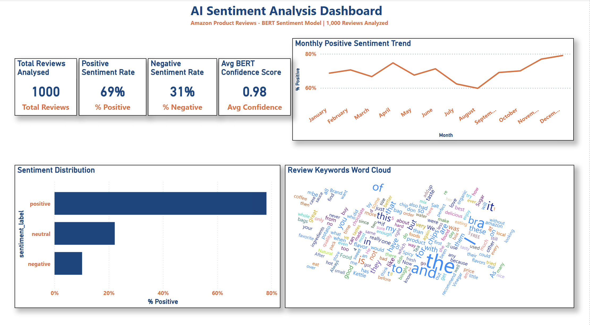

# AI Marketing Pipeline
End-to-end sentiment analytics pipeline for customer reviews and simulated social posts, built to support weekly marketing reporting.
**Tech Stack:** Python, Pandas, VADER, DistilBERT, Scikit-learn, Power BI

## Project Overview
This project turns unstructured customer text into a reporting workflow a marketing team could actually use. It benchmarks a lightweight rule-based baseline against a transformer model, extracts recurring complaint themes, generates dated text reports, and prepares outputs for a Power BI dashboard.

## Business Problem
Marketing teams cannot manually read thousands of reviews and comments every week. They need a repeatable way to answer four questions:

- Are customers broadly positive or negative right now?
- Which themes are driving complaints?
- Which sentiment model is reliable enough for production monitoring?
- Does sentiment differ across sources such as product reviews and social posts?

## Dataset And Scope
- 5,000 Amazon Fine Food reviews loaded for the project dataset
- 1,000 reviews scored with DistilBERT for the final modelling comparison
- 500 synthetic FreshBasket UK social posts added for multi-source analysis
- 1,500 total records in the combined Power BI-ready dataset
- Review date coverage: February 2005 to October 2012

## Pipeline Summary
1. Load and prepare Amazon review data.
2. Score review sentiment with VADER and DistilBERT.
3. Compare both models against star-rating-derived ground truth.
4. Extract recurring complaint themes from negative reviews.
5. Generate dated sentiment reports and a trend chart.
6. Add synthetic social data and combine both sources into one reporting dataset.

## Model Decision
The key question is not which model has the highest headline accuracy. It is which model is safer for a team that cannot afford to miss unhappy customers.

| Model | Accuracy | Positive F1 | Negative F1 |
| --- | ---: | ---: | ---: |
| VADER | 86.4% | 0.926 | 0.531 |
| DistilBERT | 85.0% | 0.904 | 0.652 |

VADER is slightly more accurate overall, but DistilBERT is materially better at detecting negative sentiment. That makes it the stronger production choice for brand monitoring and issue escalation.

## Key Results
| Area | Result |
| --- | --- |
| Review sentiment split | 693 positive / 307 negative |
| Average DistilBERT confidence | 0.9754 |
| Combined dataset | 1,500 rows with `source` column |
| Combined source mix | 1,000 reviews + 500 social posts |
| Combined sentiment split | 943 positive / 557 negative |
| Negative monitoring benefit | DistilBERT negative F1 beats VADER by 0.121 |
| Delivery outputs | processed CSVs, dated reports, trend chart, Power BI dashboard |

One modelling caveat is important: the DistilBERT checkpoint used here is binary, so neutral-style social posts are still forced into positive or negative labels during scoring.

## Architecture
```text
Amazon Reviews
    -> 01_load_data.py
    -> 02_vader_sentiment.py
    -> 02_transformer_sentiment.py
    -> 03_accuracy_comparison.py
    -> 04_topic_extraction.py
    -> 04_generate_report_api.py
    -> 05_sentiment_trend.py
    -> Power BI

Synthetic Social Posts
    -> 04_generate_social_posts.py
    -> 05_score_social.py
    -> 06_combine_sources.py
    -> 04_generate_report_api.py
    -> Power BI source comparison
```

## Files To Review First
- `README.md` for the end-to-end story and headline results
- `reports/combined_sentiment_report_latest.txt` for the business-style output
- `reports/sentiment_trend.png` for the time-series view
- `screenshots/Project2_AI_Sentiment_Dashboard_BERT_Day53_v1.png` for the dashboard preview
- `project_notes.md`, `presentation_notes.md`, and `RETROSPECTIVE.md` for model evaluation and interview prep

## Repository Structure
```text
ai_marketing_pipeline/
|-- data/
|   |-- raw/
|   `-- processed/
|-- scripts/
|   |-- 01_load_data.py
|   |-- 02_vader_sentiment.py
|   |-- 02_transformer_sentiment.py
|   |-- 03_accuracy_comparison.py
|   |-- 04_topic_extraction.py
|   |-- 04_generate_social_posts.py
|   |-- 04_generate_report_api.py
|   |-- 05_score_social.py
|   |-- 05_sentiment_trend.py
|   `-- 06_combine_sources.py
|-- reports/
|-- powerbi/
|-- screenshots/
|-- project_notes.md
|-- presentation_notes.md
|-- RETROSPECTIVE.md
|-- requirements.txt
`-- run_pipeline.sh
```

Compatibility wrappers are also retained for the original day-by-day file references:

- `scripts/01_vader_sentiment.py`
- `scripts/03_generate_report.py`
- `scripts/05_sentiment_social.py`

## How To Run
### 1. Prepare the raw data
Place the Amazon review source file at `data/raw/reviews.csv`.

### 2. Install dependencies
```bash
python3 -m venv .venv
source .venv/bin/activate
pip install -r requirements.txt
```

### 3. Run the pipeline
```bash
chmod +x run_pipeline.sh
./run_pipeline.sh
```

If `OPENAI_API_KEY` or `ANTHROPIC_API_KEY` is available, the Day 56 executive-summary step can call a hosted model. Without a key, the pipeline falls back to a deterministic local summary so the workflow still completes end to end.

## Power BI Preview
- Dashboard file: `powerbi/Project2_AI_Sentiment_Dashboard_BERT_Day53_v1.pbix`
- Screenshot: `screenshots/Project2_AI_Sentiment_Dashboard_BERT_Day53_v1.png`


